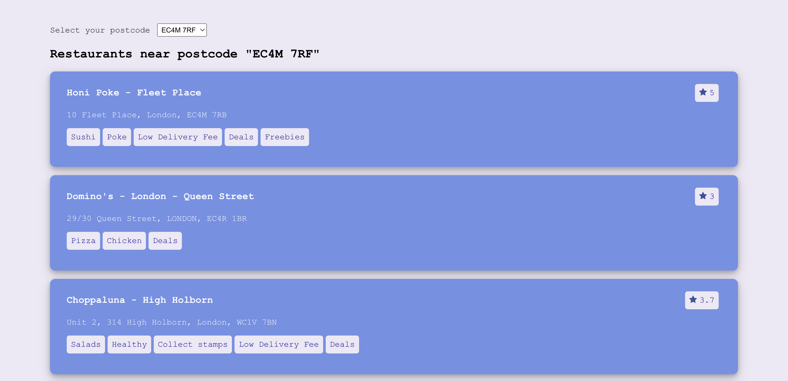

# Getting Started

This project has been built using React & Typescript.

## Prerequisites

These need to be installed in the system and upgraded to the latest version.
- `node.js`
- `npm`

## Installation

1. Clone the repository
    ```
    git clone https://github.com/prism97/jet-restaurant-app.git
    ```
2. Install the dependencies
    ```
    cd jet-restaurant-app && npm install
    ```

## Available Scripts

In the project directory, you can run:

### `npm start`

Runs the app in the development mode.\
Open [http://localhost:3000](http://localhost:3000) to view it in the browser.


This is the initial view of the interface, displaying 10 restaurants for postcode 'EC4M 7RF'. There is a dropdown on top for selecting other postcodes. Every time a new postcode is selected, the list of restaurants will update accordingly.


### `npm run build`

Builds the app for production to the `build` folder.\
It correctly bundles React in production mode and optimizes the build for the best performance.


# Assumptions & Workarounds

- The given API endpoint is public and accessible from any web browser. However, calling it from localhost led to `Cross-origin resource sharing (CORS)` error. The `Access-Control-Allow-Origin` response-header must have been set in a way that restricts access from localhost and other external origins.
- The CORS error has been bypassed by configuring a `proxy` in the `package.json` file that simulates the request being sent from the base URL of the API endpoint instead of localhost. Please note that this proxy only works in a development environment, not in a production build.
- It wasn't clearly mentioned which subfields of the response should be displayed for the data points `cuisines`, `rating`, and `address`. These have been decided considering which information is relevant for users in general. The selected and displayed subfields are given below.
    - `cuisines`: `name`
    - `rating`: `starRating`
    - `address`: `city`, `firstLine`, `postalCode`

# Possible Improvements

- No information on query parameters was provided. If the endpoint supports a query parameter to `limit` the number of restaurants sent in the response, it will lessen the load on network bandwidth. At the moment, the endpoint returns thousands of restaurants for a postcode and only the first 10 are displayed.
- Choosing & displaying the nearest or the highest rated restaurants might be more beneficial for users. This will require `filtering` & `ranking` the restaurants based on certain criteria.
